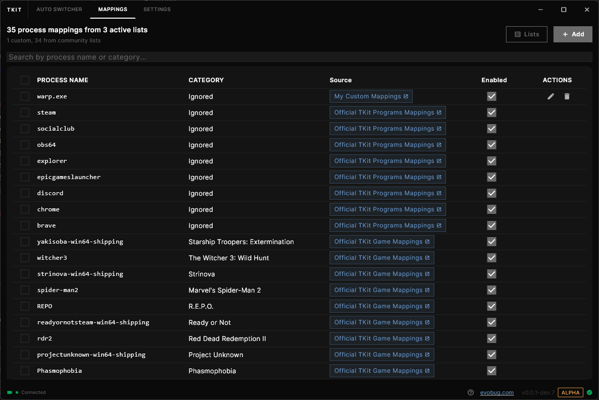
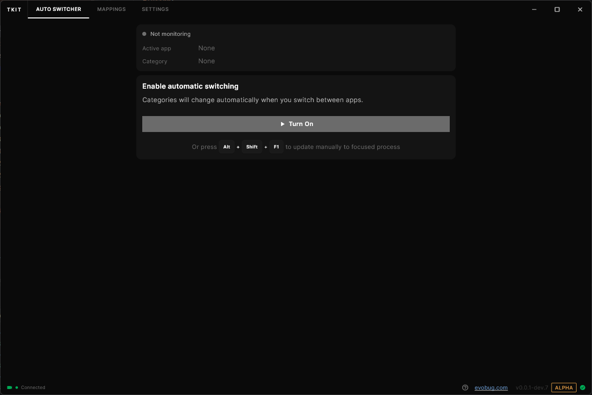

# TKit - Twitch Toolkit

**Automatically update your Twitch category based on what you're doing**

---

## 📋 Overview

TKit is a Windows desktop application that **automatically switches your Twitch stream category** based on your active window. Stop manually updating your category every time you switch games or applications - let TKit handle it for you.

**Perfect for streamers who:**
- 🎮 Switch between multiple games during streams
- 🎨 Alternate between gaming and creative work (coding, art, music)
- 😅 Forget to update categories when switching
- 📈 Want better discoverability with accurate categories

## ✨ Features

- **🔄 Automatic Category Switching** - Real-time window monitoring with instant category updates
- **🗺️ Smart Process Mapping** - Pre-seeded with popular games, searchable Twitch category database
- **⚡ Global Hotkeys** - Quick manual category updates without leaving your game
- **🌍 Multi-language Support** - 10 languages: English, Czech, Polish, Spanish, French, German, Portuguese, Japanese, Korean, Chinese
- **🔔 Desktop Notifications** - Optional alerts when categories change
- **⚙️ Configurable Behavior** - Scan intervals, debounce delays, fallback actions
- **📊 Update History** - Track all category changes with timestamps
- **🪟 System Tray Integration** - Runs quietly in the background

## 📥 Installation

### Download

<table>
<tr>
<td width="50%">

**MSIX Package** ~~(Recommended)~~
> ⚠️ **Temporarily Unavailable**
> Skip MSIX installation due to invalid certificate.
> This will be resolved in a future update.

~~[→ Download MSIX](https://github.com/evobug-com/TKit/releases/latest/download/TKit.msix)~~

</td>
<td width="50%">

**EXE Installer** (Recommended)
- 📦 Portable installation
- 🔧 Custom install location
- ✅ Automatic updates

[**→ Download from Releases**](https://github.com/evobug-com/TKit/releases)

> 💡 Select the latest pre-release and download `TKit-Setup.exe`

</td>
</tr>
</table>

<b>Pre-release Channels</b>

Want to test new features before they're stable?

| Channel | Description | Access |
|---------|-------------|--------|
| **Dev** | Bleeding edge, updated frequently | [Browse Dev Releases →](https://github.com/evobug-com/TKit/releases?q=prerelease%3Atrue+tag%3A*-dev.*) |
| **Beta** | Feature testing, relatively stable | [Browse Beta Releases →](https://github.com/evobug-com/TKit/releases?q=prerelease%3Atrue+tag%3A*-beta.*) |
| **RC** | Release candidates, final testing | [Browse RC Releases →](https://github.com/evobug-com/TKit/releases?q=prerelease%3Atrue+tag%3A*-rc.*) |

<b>Which installer should I choose?</b>

> ⚠️ **Note**: MSIX installer is temporarily unavailable due to certificate issues. Please use the EXE installer.

**EXE Installer:**
- Works on all supported Windows versions
- Custom installation directory option
- Portable installation
- Automatic updates through TKit

### Requirements

- Windows 10 (version 1809) or later
- Twitch account with streaming privileges

## 🚀 Quick Start

1. **Download & Install** - Choose your installer from above
2. **Launch TKit** - Find it in Start Menu or Desktop
3. **Connect Twitch** - Click "Connect with Twitch" and authorize
4. **Add Mappings** - Map your games/apps to Twitch categories
5. **Start Monitoring** - Click "Start" on the Auto Switcher page

That's it! TKit will now automatically update your category as you switch windows.

## 📖 Usage Guide

### Category Mappings

Map your applications to Twitch categories:

**⚡ Recommended Method** (Fast & Easy):
1. Launch the game or application you want to map
2. Press **Alt+Shift+F1** (default shortcut for manual update)
3. A dialog will appear with all information pre-filled (process name, window title, etc.)
4. Search and select the correct Twitch category
5. Save - done!

**Alternative Method** (Manual):
1. Go to **Category Mappings** page
2. Click **Add Mapping**
3. Manually enter the process name (e.g., `League of Legends.exe`)
4. Search and select the Twitch category
5. Save and enable the mapping

> ⚠️ **Note**: Manual mapping is slow and inconvenient. We highly recommend using the shortcut method instead - it's faster and automatically fills in all required information.

💡 **Tip**: TKit comes pre-seeded with popular games!

### Auto Switcher

Control automatic category switching:

- **Start/Stop Monitoring** - Toggle automatic switching
- **Manual Update** - Force update to current window's category
- **View History** - See all category changes with timestamps

### Settings

TKit is fully configurable with options for scan intervals, debounce delays, fallback behavior, notifications, hotkeys, and update channels. Access settings from the main window or system tray.

## 🛠️ For Developers

Interested in contributing or building from source?

- **[Developer Guide](DEVELOPERS.md)** - Architecture, tech stack, building from source
- **[Contributing Guidelines](CONTRIBUTING.md)** - How to contribute
- **[Release Guide](RELEASE_GUIDE.md)** - For maintainers creating releases

## 🗺️ Roadmap

> **Disclaimer**: This roadmap is not set in stone. These are just ideas we thought would be nice to have - they're straight out of our heads without proper planning or commitment. Consider this a wishlist rather than a promise.

- [ ] Multi-platform support (macOS, Linux)
- [ ] Auto-update stream title and tags
- [ ] Time-based category scheduling
- [ ] Advanced mapping rules (window title, regex)
- [ ] Cloud sync for mappings
- [ ] Integration with other platforms (YouTube, Kick)

## ⚠️ Known Limitations

- Windows-only (platform-specific process detection)
- Requires browser OAuth flow for Twitch authentication
- Mappings stored locally (no cloud sync yet)

## 🤝 Support

Need help?

- 🐛 [Report issues](https://github.com/evobug-com/TKit/issues)
- 💬 [Browse existing issues](https://github.com/evobug-com/TKit/issues)
- 📝 Check logs - Press **F2** while TKit is running to open the log overlay (helpful for understanding what happened)

## 📜 License

This project is licensed under the MIT License - see the [LICENSE](LICENSE) file for details.

## 🙏 Credits

Built with Flutter and inspired by the need for better stream automation tools.

Special thanks to the Twitch developer community for API documentation and support.

---

**Note**: TKit is not affiliated with or endorsed by Twitch Interactive, Inc.
